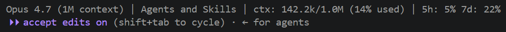

# Claude Code Essentials

Curated hooks and tooling for everyday Claude Code use. **See what your agents are doing. Block what you didn't approve. Track tokens at a glance.**



By [Mihaly Kavasi](https://github.com/KavasiMihaly) — part of the [OneDayBI Marketplace](https://github.com/KavasiMihaly/AI-plugins).

---

## What's inside

| Tool | What it does | How it installs |
|---|---|---|
| **Agent Logger** | JSONL session logs in `_Agent Logs/` per repo. Captures prompts, tool calls, subagent activity, and errors. Sensitive paths and prompts redacted. | Auto-wired on `/plugin install` |
| **Block Installs** | PreToolUse guard that catches `npm/pip/choco/winget/brew` and similar install commands and asks for explicit approval first. Approve with a ` # APPROVED` suffix. | Auto-wired on `/plugin install` |
| **Statusline** | Status bar showing model, working folder, context-window usage (`ctx: 45.2k/200.0k (23% used)`), and 5h/7d rate-limit consumption. | Manual setup — see `extras/statusline/README.md` |

Hooks are installed automatically when you `/plugin install` this marketplace entry. The statusline is a global `settings.json` setting and can't be plugin-installed; instructions are in `extras/`.

---

## Install

### 1. Add the OneDayBI marketplace (once)

```
/plugin marketplace add KavasiMihaly/AI-plugins
```

### 2. Install this plugin

```
/plugin install claude-code-essentials@OneDayBI-Marketplace
```

### 3. (Optional) Wire the statusline

The statusline is a global Claude Code setting, not a plugin-installable hook. See [`extras/statusline/README.md`](extras/statusline/README.md) for copy-paste setup.

### 4. Reload

```
/reload-plugins
```

If hooks don't fire, fully restart Claude Code (hooks snapshot at session start).

---

## What you get after install

### Per-repo logs in `_Agent Logs/`

```
_Agent Logs/
├── .gitignore                              # auto-generated, ignores all log files
├── session-2026-05-26-a1b2c3d4.jsonl       # one file per session
└── sessions-index.jsonl                    # summary index
```

Each JSONL entry looks like:

```json
{"ts":"2026-05-26T14:32:11Z","event":"PreToolUse","session_id":"a1b2c3d4","tool":"Bash","summary":"npm install lodash","details":{"command":"npm install lodash","timeout":null,"background":false}}
```

The plugin drops a `.gitignore` inside `_Agent Logs/` on first session so logs are ignored by default in every repo.

### Install-command guard

When Claude tries to run `pip install dbt-core`, the hook blocks it and prompts:

> Install command detected. Please confirm with the user, then append ` # APPROVED` to the command.

Claude asks you, you say yes, Claude re-runs as `pip install dbt-core # APPROVED` — the hook lets it through.

### Statusline

```
Claude Opus 4.7 | my-project | ctx: 45.2k/200.0k (23% used) | 5h: 12% 7d: 4%
```

See [`assets/statusline.png`](assets/statusline.png) for the rendered version in a real Claude Code session.

---

## Privacy & safety

- **No file contents are logged** — only paths.
- **Sensitive patterns are redacted**: `.env`, credentials, keys, tokens, passwords.
- **Prompts that mention secrets are masked** before logging.
- **Logs stay local** — written only to `<your-repo>/_Agent Logs/`. Nothing is sent anywhere.
- All scripts are pure Python with no external dependencies and are auditable in this repo.

---

## Configuration

No configuration required for the default experience. Per-tool tweaks (log retention, sensitive-pattern list, etc.) are in `hooks/agent-logger.py` and `hooks/block-installs.py` — they're short, readable scripts.

---

## Requirements

- Claude Code with plugin support
- Python 3.8+ on `PATH` (used by the hooks)
- `jq` (only for the statusline shell variant — Python variant is preferred)

---

## License

MIT — see [LICENSE](LICENSE).

---

## Author

**Mihaly Kavasi** — [@KavasiMihaly](https://github.com/KavasiMihaly) | [OneDayBI](https://www.onedaybi.com) | [Self-Service BI Blog](https://selfservicebi.co.uk)

Found this useful? Star the repo and browse the rest of the [OneDayBI Marketplace](https://github.com/KavasiMihaly/AI-plugins). For patterns and best practices behind these hooks, see the [Claude Code Handbook](https://github.com/KavasiMihaly/Claude-Code-Handbook).
